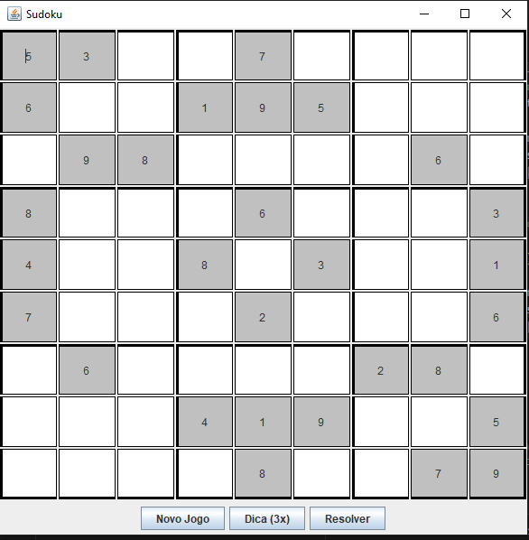

# Sudoku 9x9 - Java Swing GUI

---

## Description
Interactive 9x9 Sudoku game developed in Java with Swing. Features:
- 9x9 grid with 3x3 visual blocks
- Editable and fixed cells
- Input validation (1-9, no duplicates in row/column)
- Automatic win detection
- Buttons: New Game, Hint (3x), Solve

## How to Run
1. Open the project in your Java IDE (e.g., VSCode or IntelliJ)
2. Run `App.java`
3. Enjoy the game!

## Features
- Input verification for numbers
- Visual 3x3 blocks
- Interactive buttons
- Victory message when the board is correctly filled

## Notes
- Hints are limited to 3 uses
- Solve button temporarily shows the solution

## About
This project is a fully interactive 9x9 Sudoku game developed entirely by me (Michael Dev).
It demonstrates skills in Java Swing GUI, input validation, and game logic.
